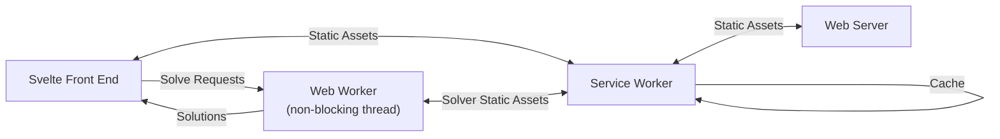

<h1>

Poker Chipper

</h1>

<a href="https://jstrieb.github.io/poker-chipper" target="_blank">Optimally
select poker chip denominations for cash games using constrained, nonlinear
optimization.</a>

# About

Imagine hosting a small poker game. You know how many friends will attend, how
many chips you have, and how much everyone will pay to play. How do you pick
chip denominations?

Without Poker Chipper, picking chip denominations is manual and error-prone.
You first try to pick values that divide each other nicely and are easy to
remember. (Alternatively, struggle to recall the values you used last time you
played.) You next try to find a way to make the chosen values sum to the buy
in. Then, you backtrack whenever there aren't enough chips for everyone, or
when there are too many chips left over. Finally, you settle for a sub-optimal
chip allocation so that you can actually start playing.

With Poker Chipper, on the other hand, picking chip denominations is fast and
easy. Input the number of players, buy in, blinds, and number of chips. Then,
wait a moment for the mathematically optimal results, which are guaranteed to
work with the chips you have on-hand. Once the results are computed, you can
save them for next time, or share them with others. If you want to modify the
results, adjust the "advanced options," and the chip denominations will be
recomputed subject to the adjusted requirements.

# How Poker Chipper Works

Poker chipper uses mixed integer nonlinear programming (MINLP), which is a form
of constrained, nonconvex optimization, to optimally pick poker chip
denominations. 

Optimization is performed using a "solver" – in this case,
[SCIP](https://www.scipopt.org/). Some inputs to Poker Chipper are translated
into solver constraints, which affect what denominations are admissible. Other
inputs influence the solver's objective function, which affects how candidate
denominations are evaluated, ranked, and chosen. Inputs affecting constraints,
and inputs affecting the objective function are described in the user interface
as influencing the "requirements" and "score," respectively, of candidate
solutions.

Poker Chipper is a fully static web application. In other words, all of the
processing involved in performing optimization occurs client-side – entirely in
the user's browser. The SCIP solver is designed to run natively, so Poker
Chipper bundles it for the browser by compiling SCIP to WebAssembly (WASM) with
[Emscripten](https://emscripten.org/).

## How to Read the Code

### Code Table of Contents

The links below are listed in the order the code should be read to understand
the application from the highest to lowest level.

- [`src/App.svelte`](src/App.svelte) – main high-level application
- [`src/*.svelte`](src/) – UI components
- [`src/solve.js`](src/solve.js) – convert user inputs to MINLP model and solve
  using WASM SCIP
- [`src/solveWorker.js`](src/solveWorker.js) – web worker to run solver in
  non-blocking thread
- [`public/serviceWorker.js`](public/serviceWorker.js) – service worker for
  caching and offline functionality
- [`public/*`](public/) – PWA manifest, global stylesheet, favicons, etc.
- [`experiments/*`](experiments/) – exploration of initial concept in Python
  (with both Z3, and later, SCIP), and Dockerfile for compiling SCIP with
  Emscripten
- [`src/compiled/*`](src/compiled/) – SCIP compiled to WASM via Emscripten,
  plus associated support files

### Application Architecture

In the diagram below, labeled arrows represent asynchronous fetch requests and
message passing.

# Project Status & Contributing

Poker Chipper is actively maintained. If there are no recent commits,
everything is running smoothly! As of the initial release, the code is stable,
and there are no major, outstanding features that remain to be added.

Bug reports and feature requests via GitHub Issues are encouraged. Pull
requests with more than 20 lines of code are unlikely to be merged quickly,
unless associated with prior discussion or accompanied by substantial,
explanatory English prose. In other words, pull requests containing code
without context may be merged after much delay, or may not be merged at all.

Since Poker Chipper is a fully static web application with no server-side
processing (outside of serving unchanging files), it is extremely scalable, and
has a very low maintenance burden. As such, even if something were to happen to
me, and I could not continue to work on the project, the [public
version](https://jstrieb.github.io/poker-chipper/) should continue to remain
functional and available online as long as my GitHub account is open and the
[jstrieb.github.io](https://jstrieb.github.io) domain is active.

## Support the Project

The best ways to support the project are to:

- Share the project on sites like Twitter, Reddit, and Hacker News
- Report any bugs, glitches, errors, or shortcomings that you find
- Star the repository and follow me on GitHub
- Host a version of the code translated into another language

If you insist on spending money to show your support, please do so in a way
that is widely beneficial. In particular, donations to the following
organizations help me, in addition to the general, Internet-using public:

- [Electronic Frontier Foundation](https://supporters.eff.org/donate/)
- [The Internet Archive](https://archive.org/donate/index.php)
- [Signal Foundation](https://signal.org/donate/)
- [Mozilla](https://donate.mozilla.org/en-US/)

# Acknowledgments & Greetz

Poker Chipper would not have been possible without help and feedback from:

- [Logan Snow](https://github.com/lsnow99)
- [Amy Liu](https://www.linkedin.com/in/amyjl)
- [Chris Cherian](https://twitter.com/chrischerian)
- [Ani Chowdhury](https://www.linkedin.com/in/ani-chowdhury)
- Will Hooper

